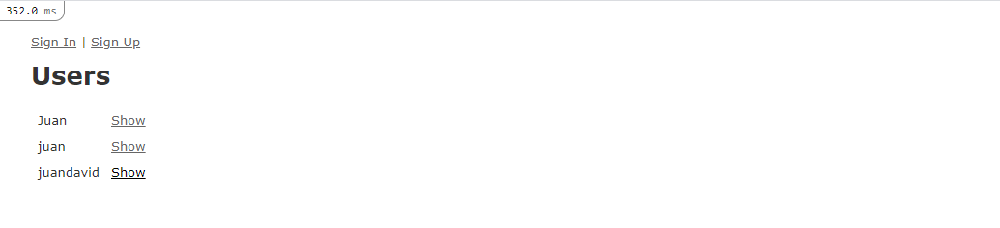

# Associations - Ruby on Rails

> This project ilustrates how associations and complex queries work in a Rails app

## Built With

- Ruby on Rails
- Using Linters for Ruby and Stylelint
- Git, GitHub
- Using Bundler

## Getting Started

To get a local copy up and running follow these simple steps.

1. Go to the main page of te repo. `git clone https://github.com/JuanDavid31/private-events.git`
2. Press the "Code" button and get the repo link.
3. Clone it using git.
4. Open terminal on that folder.
5. run `npm install`
6. run `bundle install`
7. run `rails db:migrate` to migrate the database 
8. run `rails server`
9. Go to `http://localhost:3000` on your browser to view the homepage of the application 

## Signing Up

- Go to `http://localhost:3000/sign_up` on your web browser.

## Signing In

- Go to `http://localhost:3000/sign_in` on your web browser.

## Creating a new Event

- Go to `http://localhost:3000/events/new` on your web browser

## Inviting people to and event

1. Got to `http://localhost:3000/events/:id` where `:id` is the event id.
2. Click on any **Invite** link is available.

Note: If there are no **Invite** links available is because there are no users to invite.
Create some users and try again. 

## How to run the test

Testing was done using the default rails library for testing: Minitest.

### Model tests

1. Open a command line terminal on the project root folder.
2. Run `rails db:migrate RAILS_ENV=test` to execute the migration files. 
3. Run `rails test test/models`

### System tests

1. Open a command line terminal on the project root folder.
2. Run `rails db:migrate RAILS_ENV=test` to execute the migration files.
- Run `rails test test/system/authentication_test.rb:4` to test the index page.
- Run `rails test test/system/authentication_test.rb:10` to test the sign up.
- Run `rails test test/system/authentication_test.rb:22` to test the sign in and sign out.
- Run `rails test test/system/events_managements_test.rb:4` to test the creation of an event. 
- Run `rails test test/system/events_managements_test.rb:14` to test the invitation of new people to any event.

Note: Systems test should be run individually to prevent IOError(s).

## Prerequisites

Before you continue, be sure that you have installed:

- A Git GUI.
- Ruby 2.7.2
- Most recent Rails version 
- NPM or Yarn
- An IDE like RubyMine or a Text Editor like Vs code.

## 🤝 Contributing

Contributions, issues and feature requests are welcome!

Feel free to check the [issues page](https://github.com/JuanDavid31/re-former/issues).

### Steps

1. Fork this repository.

2. Create a branch: git checkout -b <branch_name>.

3. Make your changes and commit them: git commit -m '<commit_message>'

4. Push to the original branch: git push origin <project_name>/

5. Create the pull request.

Alternatively see the GitHub documentation on creating a pull request. Feel free to check the issues page.

## Show your support

Give a ⭐️ if you like this project!

## Authors

👤 **Juan David Piza**

- GitHub: [@JuanDavid31](https://github.com/JuanDavid31)

## Acknowledgments

- [Microverse](https://www.microverse.org)
- [Rails-Doc](https://guides.rubyonrails.org/)
- [Odin-Project](https://www.theodinproject.com/courses/ruby-on-rails/lessons/building-with-active-record-ruby-on-rails)
- Our stand up teams

## 📝 License

This project is <a href="LICENSE">MIT</a> licensed.

## Enjoy!
